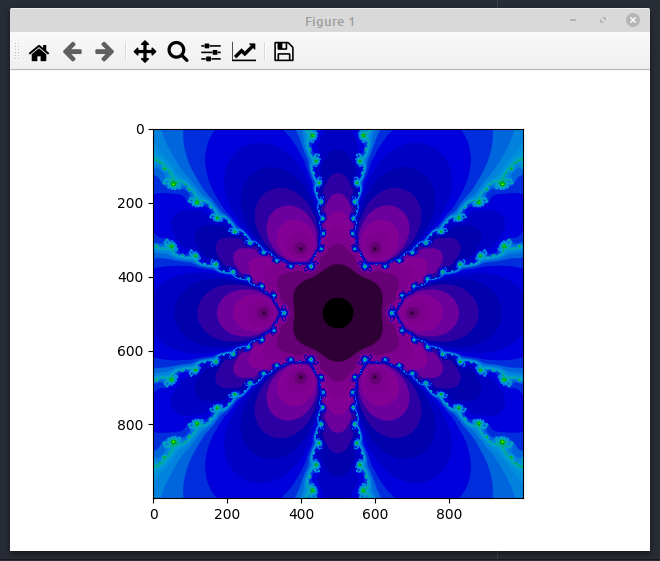

### Newton Fractal using numpy Polynomial

```python
import numpy as np
import numpy.polynomial.polynomial as polynomial
import matplotlib.pyplot as plt

f = polynomial.Polynomial([0,-1,0,0,0,0,0,1], domain=[-2,2]) # -x + x^7
fp = polynomial.Polynomial.deriv(f)
def newton(i, guess):
    a = np.empty(guess.shape,dtype=int)
    a[:] = i
    j = np.abs(f(guess))>.0001
    if np.any(j):
        a[j] = newton(i+1, guess[j] - np.divide(f(guess[j]),fp(guess[j])))
    return a

npts = 1000
x = np.linspace(-5,5,npts)
y = np.linspace(-5,5,npts)
xx, yy = np.meshgrid(x, y)
pic = np.reshape(newton(0,np.ravel(xx+yy*1j)),[npts,npts])
plt.imshow(pic)
plt.show()
```


